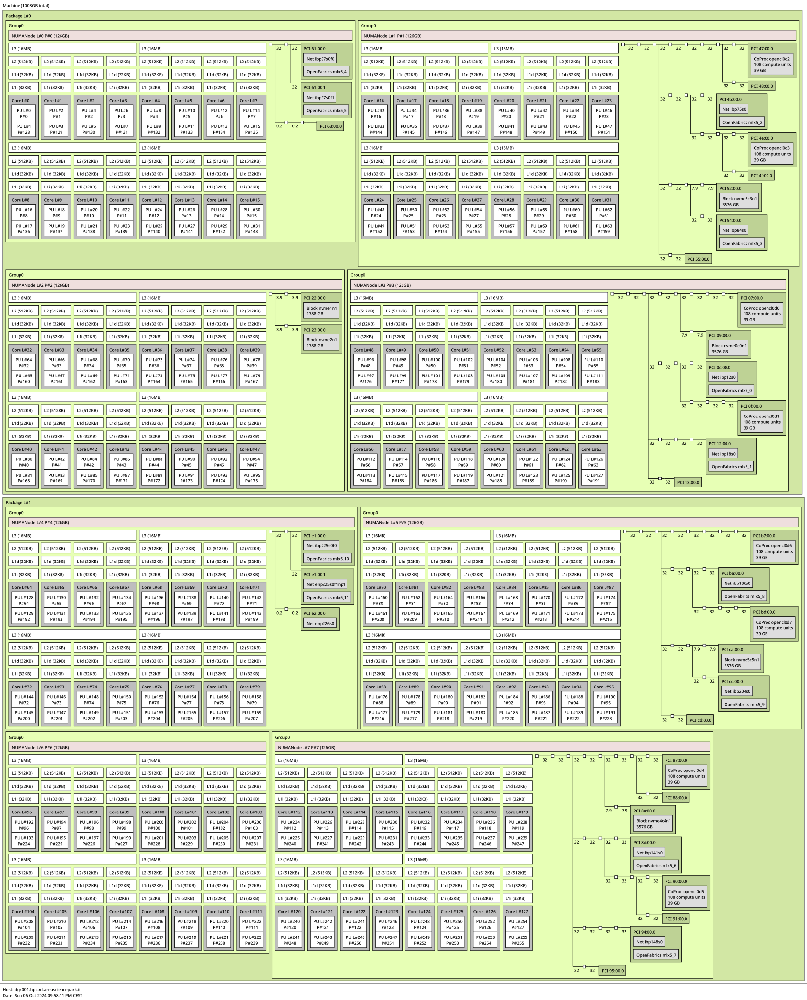

# Exploring Computational Nodes

## Processor

### `lscpu`

The `lscpu` command is the most common tool used to explore CPU specifications on Linux. It gathers information from `sysfs` and `/proc/cpuinfo`, and displays a summary when run without any options. The key fields to note are:

- **CPU(s)**: Total number of CPUs.
- **Model name**: CPU model.
- **Thread(s) per core**: Indicates if Simultaneous Multithreading (SMT) is enabled. A value of 1 means SMT is disabled, while values greater than 1 indicate SMT is enabled.
- **Core(s) per socket**: Number of cores in each processor.
- **Socket(s)**: Number of sockets present on the motherboard.
- **CPU MHz scaling**: Frequency scaling factor (note that each core may run at a different frequency).
- **CPU [min|max] MHz**: Minimum and maximum frequency for the CPUs.
- **Flags**: Lists CPU capabilities. This includes support for AVX, SSE, and 64-bit computation. You can view the full list of flags [here](https://git.kernel.org/pub/scm/linux/kernel/git/stable/linux.git/tree/arch/x86/include/asm/cpufeatures.h).
- **Caches**: Summary of cache sizes and counts.
- **NUMA nodes**: Details about Non-Uniform Memory Access (NUMA) nodes, including which CPUs belong to which NUMA node.
- **Vulnerabilities**: A list of known CPU vulnerabilities. Disabling some mitigations may result in performance gains, but this should be done cautiously.

### `lscpu --caches`

This command provides detailed information about cache configurations. Example outputs for two types of CPUs, `THIN` and `EPYC`, are shown below:

**THIN CPU**
```bash
NAME ONE-SIZE ALL-SIZE WAYS TYPE        LEVEL  SETS PHY-LINE COHERENCY-SIZE
L1d     32K     768K    8   Data        1      64    1       64
L1i     32K     768K    8   Instruction 1      64    1       64
L2       1M      24M    16  Unified     2      1024  1       64
L3     19.3M    38.5M   11  Unified     3      28672 1       64
```

**EPYC CPU**
```bash
NAME ONE-SIZE ALL-SIZE WAYS TYPE        LEVEL  SETS PHY-LINE COHERENCY-SIZE
L1d     32K       4M    8   Data        1      64    1       64
L1i     32K       4M    8   Instruction 1      64    1       64
L2     512K      64M    8   Unified     2      1024  1       64
L3      16M     512M   16   Unified     3      16384 1       64
```

### `lscpu -e`

This command shows detailed CPU topology, helping identify how cores are enumerated and their individual frequencies:

**THIN CPU Example**
```bash
$ lscpu -e
CPU NODE SOCKET CORE L1d:L1i:L2:L3 ONLINE MAXMHZ    MINMHZ       MHZ
  0    0      0    0  1:1:1:0       yes  3700.0000 1000.0000 2400.0000
  1    1      1    1  17:17:17:1    yes  3700.0000 1000.0000 1000.0000
  2    0      0    2  6:6:6:0       yes  3700.0000 1000.0000 1000.0000
  3    1      1    3  22:22:22:1    yes  3700.0000 1000.0000 1000.0000
```

**EPYC CPU Example**
```bash
$ lscpu -e
CPU NODE SOCKET CORE L1d:L1i:L2:L3  ONLINE
  0    0      0    0  0:0:0:0       yes
  1    0      0    1  1:1:1:0       yes
  2    0      0    2  2:2:2:0       yes
  3    0      0    3  3:3:3:0       yes
```

**Note**: Intel and AMD machines enumerate cores differently, and Intel core frequencies may vary significantly.

### `/proc/cpuinfo`

This file provides detailed information about every core in a machine, similar to `lscpu`. It can be parsed programmatically to retrieve information without using third-party libraries.

**Note**: Terms like "Processor," "CPU," and "Core" may have overlapping meanings, but the context should make it clear.

---

## Network

### `ip a`

The `ip a` command is used to list network devices, their IP addresses, and their types (e.g., physical or virtual). Here's an example output:

```bash
4: ibp59s0: <BROADCAST,MULTICAST,UP,LOWER_UP> mtu 2044 qdisc mq state UP group default qlen 256
    link/infiniband
    inet 10.2.6.111/24 brd 10.2.6.255 scope global noprefixroute ibp59s0
5: bond0: <BROADCAST,MULTICAST,MASTER,UP,LOWER_UP> mtu 1500 qdisc noqueue state UP group default qlen 1000
    link/ether
    inet 10.2.2.111/24 brd 10.2.2.255 scope global noprefixroute bond0
```

This shows two devices: `bond0` (Ethernet-based) and `ibp59s0` (InfiniBand-based).

### `ibstat` / `ibstatus`

These commands are used to query the status of InfiniBand devices:

```bash
$ ibstatus
Infiniband device 'ibp59s0' port 1 status:
	default gid:	
	base lid:	   0x14
	sm lid:		   0x1
	state:		   4: ACTIVE
	phys state:	   5: LinkUp
	rate:		   100 Gb/sec (2X HDR)
	link_layer:	   InfiniBand
```

This shows an active InfiniBand device with a 100 Gb/sec data rate.

---

## PCI Devices

PCI devices like GPUs, network cards, NVMe drives, and RAID controllers are connected to the motherboard via the PCI bus. It's crucial to explore these devices for hardware diagnostics.

### `lspci`

The `lspci` command lists all PCI components. Adding the `-v` flag provides more details, especially for network and InfiniBand devices:

```bash
$ lspci -vvvvvv | grep -i infi -A 12
3b:00.0 Infiniband controller: Mellanox Technologies MT28908 Family [ConnectX-6]
	Subsystem: Mellanox Technologies Device 0029
	Kernel driver in use: mlx5_core
	NUMA node: 0
	Region 0: Memory at ac000000 (64-bit, prefetchable) [size=32M]
	Expansion ROM at ab000000 [disabled] [size=1M]
	Capabilities: <access denied>
	Kernel modules: mlx5_core
```

This shows the Infiniband card model, driver, NUMA region, and memory configuration. Additional information, like PCI lane width, can also be retrieved:

```bash
LnkSta: Speed 16GT/s, Width x16
```

You can visualize PCI device topology using the `lspci -tv` command or by examining `/proc/bus/pci`.

---

## `hwloc`

`hwloc` is a powerful tool for querying machine topology. The `lstopo` command generates a graphical or textual representation of the system hardware layout.


### `hwloc-info`

This command provides a summary of system topology:

```bash
$ hwloc-info
depth 0:            1 Machine (type #0)
 depth 1:           2 Package (type #1)
  depth 2:          8 Group0 (type #12)
   depth 3:         32 L3Cache (type #6)
    depth 4:        128 L2Cache (type #5)
     depth 5:       128 L1dCache (type #4)
      depth 6:      128 L1iCache (type #9)
       depth 7:     128 Core (type #2)
        depth 8:    256 PU (type #3)
Special depth -3:   8 NUMANode (type #13)
Special depth -4:   90 Bridge (type #14)
Special depth -5:   36 PCIDev (type #15)

## Storage


