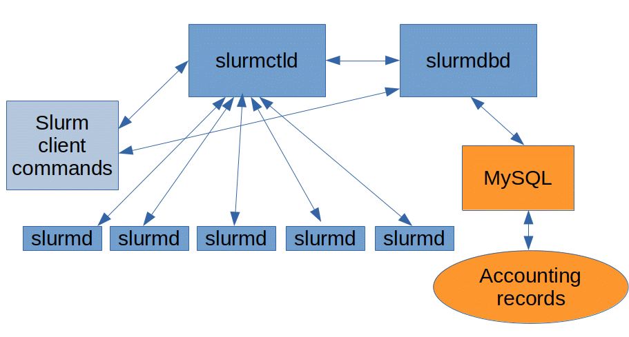

# SLURM Tutorial

## Overview of SLURM Structure and Components

SLURM consists of three main services that coordinate the management of resources and job scheduling:

- `slurmd`
- `slurmctld`
- `slurmdbd`



### slurmd

`slurmd` is the daemon responsible for managing and controlling the access to resources on the nodes it runs on. It launches user jobs and communicates with the main controller daemon (`slurmctld`). It operates on both the login node and every compute node, and all SLURM commands rely on this service to function.

To check the status of the `slurmd` daemon, use the following command:

```bash
$ systemctl status slurmd
● slurmd.service - Slurm node daemon
     Loaded: loaded (/usr/local/lib/systemd/system/slurmd.service; enabled; preset: disabled)
    Drop-In: /usr/lib/systemd/system/service.d
             └─10-timeout-abort.conf
             /etc/systemd/system/slurmd.service.d
             └─override.conf
     Active: active (running) since Tue 2024-09-17 09:58:02 CEST; 2 weeks 5 days ago
   Main PID: 1329 (slurmd)
      Tasks: 6
     Memory: 8.0M (peak: 9.2M)
        CPU: 6.998s
     CGroup: /system.slice/slurmd.service
             └─1329 /usr/local/sbin/slurmd -D -s --conf-server slurm-server.hpc.rd
```

### slurmctld

`slurmctld` is the core controller daemon, handling job scheduling and resource management. It maintains the main configuration and keeps track of available resources. It relies on three key configuration files:

- **`slurm.conf`**: Defines partitions, nodes, plugins, and scheduler settings. [SLURM Configuration Documentation](https://slurm.schedmd.com/slurm.conf.html)
- **`gres.conf`**: Manages Generic Resource (GRES) configurations, such as GPU assignments and NUMA region allocations. [GRES Documentation](https://slurm.schedmd.com/gres.conf.html)

Configuration files are located at `/var/spool/slurm/d/conf-cache/` and are updated automatically through `slurmd`.

### slurmdbd

`slurmdbd` is responsible for storing job history, accounting resource usage by partition, account, and user, and managing job priorities. It uses a SQL database as a backend to store this information, and queries on past jobs are processed by this service.

## Enforcing Job Constraints

When a job is run on a node, a Linux **Scope** is created to contain the processes spawned by the job. Each scope has specific resources (CPU, memory, GPU, etc.) assigned, which are enforced via **cgroups**. To inspect these scopes, you can use the following command on the compute node:

```bash
systemctl status
```

The output will show the jobs and their respective steps, such as:

```
           │ ├─slurmstepd.scope
           │ │ ├─job_809775
           │ │ │ └─step_16
           │ │ │   ├─slurm
           │ │ │   │ └─2176135 "slurmstepd: [809775.16]"
           │ │ │   └─user
           │ │ │     └─task_0
           │ │ │       ├─2176143 /usr/bin/make
```

To check which resources are allocated to a job, use the `cat` command to view the job’s cgroup information:

```bash
[user@login02 ~]$ srun -n1 -c 16 -N1 -p EPYC --time=12:0:0 --mem=32G --pty bash
[user@epyc001 ~]$ cat /proc/$$/cgroup
0::/system.slice/slurmstepd.scope/job_840392/step_0/user/task_0
```

You can also check the requested resources by navigating to the cgroup directory:

```bash
[user@epyc001 user]$ cd /sys/fs/cgroup/system.slice/slurmstepd.scope/job_840392/
[user@epyc001 user]$ cat memory.max
34359738368
[user@epyc001 user]$ cat cpuset.cpus
1-16
[user@epyc001 user]$ cat cpuset.mems
0-7
```

This displays the maximum memory, allocated cores, and accessible NUMA regions for the job. All processes spawned within this scope inherit the assigned resource constraints.

## Python SBATCH Script Example

In addition to traditional job scripts, you can also use Python scripts for submitting jobs:

```python
$ cat sbatch_python.py
#!/usr/bin/env python3

# SLURM directives
#SBATCH --job-name=my_python_job
#SBATCH --ntasks=1
#SBATCH --time=00:10:00
#SBATCH --mem=4G
#SBATCH --partition=EPYC

print("This is my SLURM job running a Python script!")
```

The first line, known as the **shebang**, specifies which interpreter to use for running the script.

## Job Arrays

Job arrays are useful for high-throughput computing tasks where multiple jobs need the same resources and run the same task, but can be executed independently. Common examples include hyperparameter tuning in machine learning models.

Each job in the array has special variables that identify it:

- `SLURM_ARRAY_JOB_ID`: The job ID of the array.
- `SLURM_ARRAY_TASK_ID`: The index of the job within the array.
- `SLURM_ARRAY_TASK_COUNT`: The total number of tasks in the array.
- `SLURM_ARRAY_TASK_MAX`: The highest index in the array.
- `SLURM_ARRAY_TASK_MIN`: The lowest index in the array.

Example:

```bash
$ cat myjob.sh
#!/usr/bin/bash
# SLURM directives
#SBATCH --job-name=my_python_job
#SBATCH --ntasks=1
#SBATCH --time=00:10:00
#SBATCH --mem=4G
#SBATCH --partition=EPYC

echo "This is my SLURM array job running, id: ${SLURM_ARRAY_TASK_ID}"
```

To run this job array:

```bash
$ sbatch --array=1-4 myjob.sh
Submitted batch job 840456
$ cat slurm-840456_*
This is my SLURM array job running, id: 1
This is my SLURM array job running, id: 2
This is my SLURM array job running, id: 3
This is my SLURM array job running, id: 4
```

## Job Dependencies

You can enforce job dependencies, ensuring that one job starts only after another completes successfully. This is useful for sequential tasks, such as training a model and then validating it.

```bash
$ sbatch first.sh
Submitted batch job 840460
$ sbatch -d after:840460 second.sh
Submitted batch job 840461
```

In this case, the second job will start only if the first job completes.
